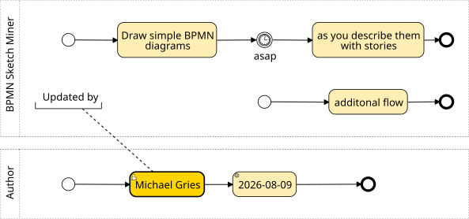
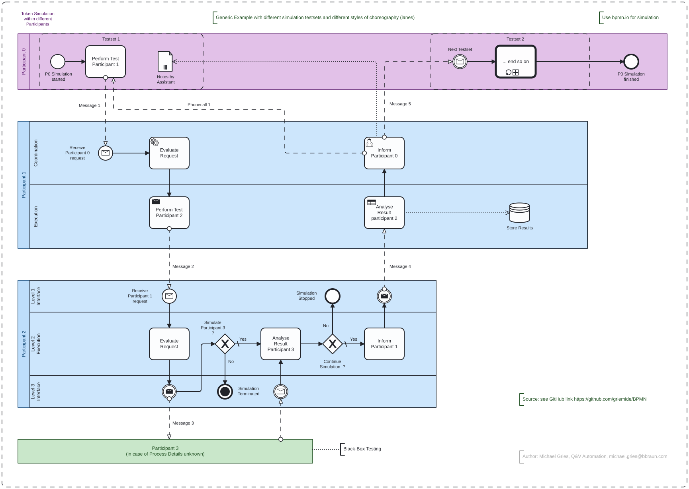
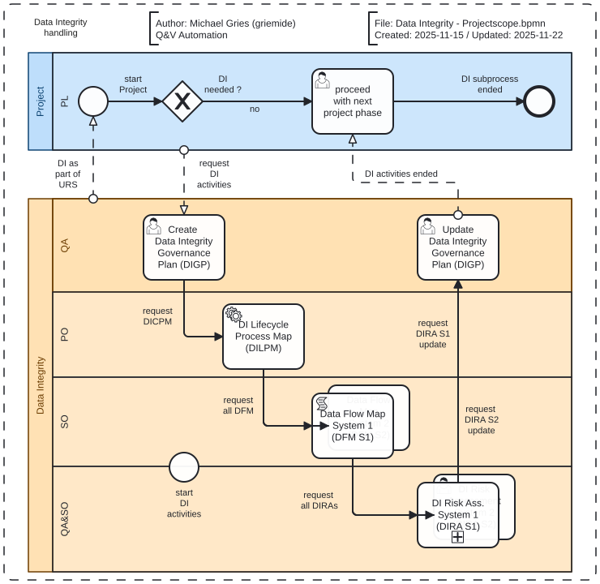
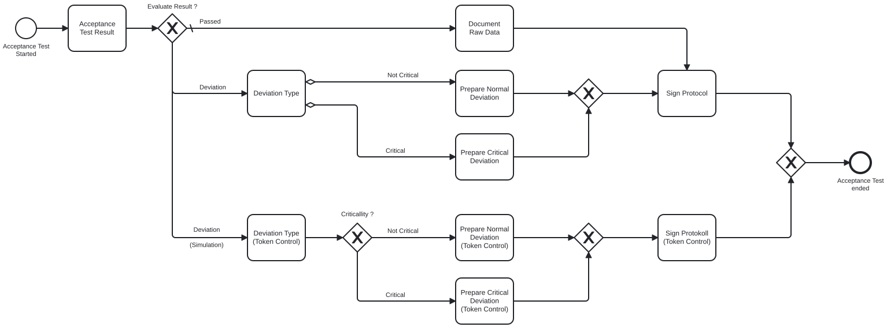

# BPMN
Business Process Model and Notation

## BPMN Sketch Miner (as quick alternativ with AI support)
Homepage: [BPMN Sketch Miner](https://www.bpmn-sketch-miner.ai/index.html)  
> Example: 

## Camunda (as alternativ to Diagrams.net aka draw.io)
Blog: [BPMN diagrams to document business processes.](https://viewer.diagrams.net/index.html?splash=0&ui=kennedy&ibs=bpmn2&title=#Uhttps%3A%2F%2Fraw.githubusercontent.com%2Fjgraph%2Fdrawio-diagrams%2Fdev%2Fblog%2Fbpmn-2-example.drawio#%7B%22pageId%22%3A%22C22Zyo9x9_IkmYV2H3KQ%22%7D)

## Private Process Flows
https://github.com/griemide/mgBPMN

### Participant Handling & Token Simulation

### Data Integrity & Token Simulation

---
## 🟢 Flow Objects (Flussobjekte)

### 1. Events (Ereignisse)
- **Start Event**: Beginn eines Prozesses  
- **Intermediate Event**: Zwischenereignis (z. B. Timer, Nachricht)  
- **End Event**: Abschluss eines Prozesses

### 2. Activities (Aktivitäten)
- **Task**: Einzelne Aufgabe  
- **Sub-Process**: Unterprozess (kann erweitert oder eingebettet sein)  
- **Call Activity**: Aufruf eines externen Prozesses

### 3. Gateways (Verzweigungen)
- **Exclusive Gateway (XOR)**: Entweder-oder  
- **Parallel Gateway (AND)**: Gleichzeitige Ausführung  
- **Inclusive Gateway (OR)**: Eine oder mehrere Pfade  
- **Event-based Gateway**: Entscheidung basierend auf Ereignis

---
## 🔵 Connecting Objects (Verbindungselemente)

- **Sequence Flow**: Standardfluss zwischen Aktivitäten  
- **Message Flow**: Kommunikation zwischen Pools  
- **Association**: Verbindung zu Annotationen oder Datenobjekten

---
## 🟠 Swimlanes (Bahnen zur Organisation)

- **Pool**: Repräsentiert eine Organisation oder ein System  
- **Lane**: Unterteilung eines Pools, z. B. nach Abteilungen
---
## 🟣 Artifacts (Zusätzliche Informationen)

- **Data Object**: Daten, die verwendet oder erzeugt werden  
- **Group**: Visuelle Gruppierung von Elementen  
- **Annotation (Text Annotation)**: Kommentare oder Erklärungen

# Workshop example - Acceptance Testing (Token Simulation example)

